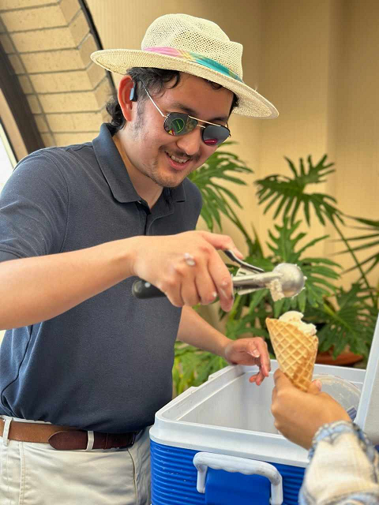

I'm originally from Nashville, Tennessee, and have lived all over Virginia, most notably on Yesáh lands, which is why I am honored to contribute to the revitalization of Yesa:sahį́. I got my undergrad degree in linguistics and computer science at the College of William & Mary.

# I like language

I started my linguistic training as a psycholinguist. My psycholinguistic training is still evident in my research methods - my first instinct is always to throw something into [Ibex Farm](https://adrummond.net/ibexfarm) (RIP) and send it to a hundred people.

I'm B1-B2-ish ([CEFR scale](https://en.wikipedia.org/wiki/Common_European_Framework_of_Reference_for_Languages)) in Mandarin Chinese, Japanese, and German. That's conversational but crunchy. I speak them like pie crust - the foundation is there, but it's flaky.

I'm currently working on French, and one day I'll return to Levantine Arabic, Polish, Spanish, Swahili, and Thai.

# I program

I was a software engineer in industry for four years. My specialty is front-end web development. I like making websites usable, accessible, and neat-looking.

# I do other things

I make animations and films. Some favorites from my work:

* [Ghosts 'n' Stuff](https://www.youtube.com/watch?v=yJ94ScwFZmU) - an animation in the style of Just Dance
* [Wing It And Sing It](https://www.youtube.com/@WingItAndSingIt) - a web show where I have musical guests perform songs they've never heard before

In 2017 I was the 16th best Just Dance player in the United States.

I like cooking. Here are some [recipes](https://www.cinc.kitchen/users/Adam) I've written.
