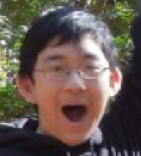

I'll be attending the [College of William and Mary](http://wm.edu) as part of the class of 2020.

Before that, I attended [Jefferson High School.](http://www.tjhsst.edu)

Before that, I attended [Rachel Carson Middle School](http://www.fcps.edu/RachelCarsonMS), which was way better than Jefferson.

# I speak languages

I'm a B1 in Japanese. I competed in the [Japan Bowl](http://www.jaswdc.org/page-1451994) three times, and got seventh, fifth, and fourth place, respectively. Japanese was my first foreign language I seriously studied, and it's still one of my favorite things ever.

I have also taught myself:

* German, probably A2-ish
* Spanish, also A2-ish
* Chinese, horrible

# I do web design

I lean front-end and I like making websites usable and neat-looking.

* Good at HTML, CSS, JS, Java.
* Decent at Ruby on Rails. I spend most of my programming time diddling with Rails, so I'm getting there...
* Bootstrap? Does that count?
* Can use Photoshop and most tantamount photo-editing programs.

Check out my [portfolio](portfolio.html) for some of my work.

This site is built on Jekyll, a lovely static site generator.

# I am capable of other things

Occasionally I write things and I [put them here.](writing.html)

Other interests include theatre (I was a [Cappies](http://cappies.com) critic!), Minecraft, Hitman, and making onion rings.

Here's what I looked like November of freshman year:

[TL;DR](tldr.html)
