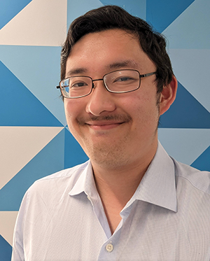

My [name](name) is Adam Ryan An [ædəm ɹaɪən æn] (he/him). I'm a PhD student at the University of Kansas; I work on morphosyntax, language variation and change, documentation, and revitalization. My current projects include:

* Variation and change in Bantu verbal morphology
* Reconstruction and revitalization of Yesa:sahį́ (a.k.a. Tutelo-Saponi) (Siouan)
* Variation in the syntax of Mandarin Chinese-English codeswitching

**Email:** adamanlinguistics [at] gmail [dot] com

**Twitter:** [@adamanlx](https://twitter.com/adamanlx)

**Bluesky:** [@adamanlx.bsky.social](https://bsky.app/profile/adamanlx.bsky.social)

[More about me](about)